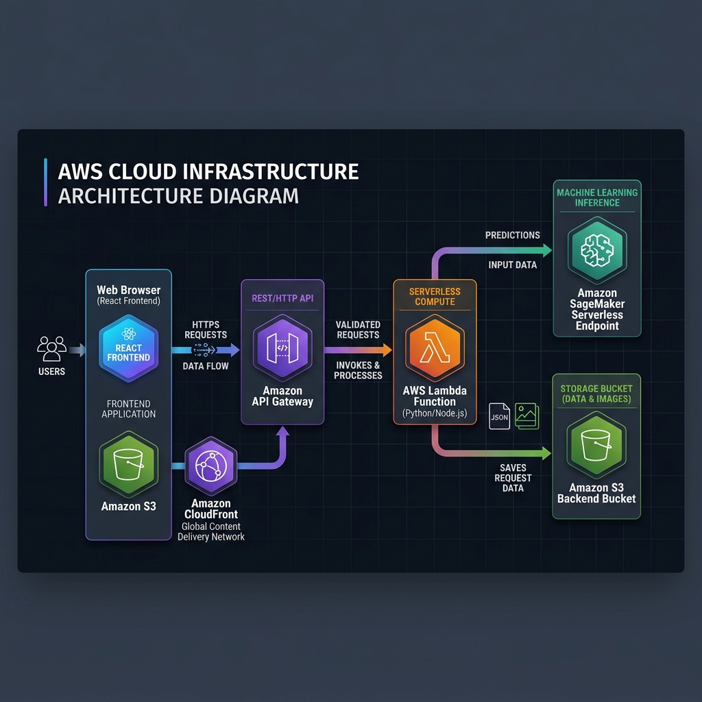

# Playing Card Classifier

This repository is a consolidated monorepo containing the code, ML models, and infrastructure for an AWS-based playing card classification system. It leverages a TensorFlow model trained to identify playing cards from images, exposed via a serverless API endpoint, and consumed by a modern React frontend.

---

## Project Structure

The project is organized into the following key directories:

* **[`frontend/`](file:///home/tarter/repos/playing-card-classifier/frontend)**: The React-based frontend application. Users can upload images of playing cards or take photos using their device camera.
* **[`lambda/`](file:///home/tarter/repos/playing-card-classifier/lambda)**: The AWS Lambda function backend code that serves as the API endpoint. It decodes client base64 image data, triggers SageMaker inference, and logs results and raw images to S3.
* **[`model/`](file:///home/tarter/repos/playing-card-classifier/model)**: Contains everything related to the SageMaker machine learning model, including training scripts (`Playing Card Classifier ML Model.ipynb`), local test scripts (`test.py`), and model artifacts.
* **[`terraform/`](file:///home/tarter/repos/playing-card-classifier/terraform)**: Infrastructure-as-code to deploy the entire stack to AWS automatically.
* **`docs/`**: Top-level system architecture diagrams.
* **`tests/`**: Model verification and testing notebooks.

## System Architecture



1. **Frontend**: Host static React files in a private S3 bucket, served via a global CloudFront CDN distribution secured with HTTPS and configured for SPA routing.
2. **API Endpoint**: Exposed via Amazon API Gateway, proxying POST/OPTIONS requests directly to AWS Lambda.
3. **Compute (Lambda)**: A Python 3.9 Lambda function preprocesses incoming images (converting them to a 224x224 RGB numpy array) and invokes the ML model.
4. **Machine Learning (SageMaker)**: A SageMaker endpoint processes the tensor and returns a classification label and confidence score. By default, this is deployed to a **Serverless Endpoint** (scaling to zero when idle) to reduce cost to practically $0/day.
5. **Storage**: Logged images and JSON results are stored in an S3 bucket for auditing, monitoring, and model retraining.

---

## Getting Started

### Prerequisites
- AWS CLI configured with administrator credentials (`aws configure`).
- Terraform CLI (`>= 1.0`) installed.
- Node.js (`>= 14`) and npm.
- Python (`>= 3.9`) and `pip` for local packaging.

---

## AWS Deployment with Terraform

The infrastructure is located in the [`terraform/`](file:///home/tarter/repos/playing-card-classifier/terraform) directory.

### 1. Build the Lambda Package
Run the packaging script to compile and compress the Lambda function dependencies (`numpy` and `Pillow`) under a Linux-compatible target:
```bash
cd terraform/
./build_lambda.sh
```
This generates a `lambda.zip` archive in the `terraform/` directory.

### 2. Initialize and Deploy
Initialize Terraform:
```bash
terraform init
```

Review the deployment plan:
```bash
terraform plan
```

Deploy the resources to AWS:
```bash
terraform apply
```

During the prompt, confirm the apply. By default, this will set up the SageMaker endpoint in **Serverless** mode. If you prefer to deploy to a real-time `ml.m5.large` instance instead, set `deploy_serverless = false` in your variables or run:
```bash
terraform apply -var="deploy_serverless=false"
```

Once deployment completes, note down the output values:
- `api_endpoint_url`: The URL for the API Gateway backend.
- `cloudfront_domain_name`: The public URL of the React frontend.
- `s3_frontend_bucket`: The bucket name where you will upload the React frontend assets.

---

## Deploying the Frontend

Once the infrastructure is up, deploy the React frontend:

### 1. Configure Frontend Environment
Create or edit `frontend/.env.production.local` and set the backend API URL using the `api_endpoint_url` from your Terraform outputs:
```bash
REACT_APP_API_BASE_URL=https://<your-api-id>.execute-api.<region>.amazonaws.com/prod
```

### 2. Build the Static Assets
Navigate to the frontend directory, install dependencies, and build:
```bash
cd ../frontend/
npm install
npm run build
```
This builds an optimized production build in `frontend/build/`.

### 3. Upload to S3
Sync the compiled static files to the frontend S3 bucket (using the `s3_frontend_bucket` name from Terraform):
```bash
aws s3 sync build/ s3://<s3_frontend_bucket_name> --delete
```

### 4. Invalidate CloudFront CDN Cache
To ensure the updated website is visible immediately, invalidate the CloudFront CDN cache:
```bash
aws cloudfront create-invalidation --distribution-id <YOUR_CLOUDFRONT_DISTRIBUTION_ID> --paths "/*"
```
*(Your Distribution ID can be found in the AWS console or CloudFront outputs.)*

---

## Cleanup

To teardown all deployed resources and avoid any charges, run:
```bash
cd ../terraform
terraform destroy
```

---

## License

This project is licensed under the MIT License.
