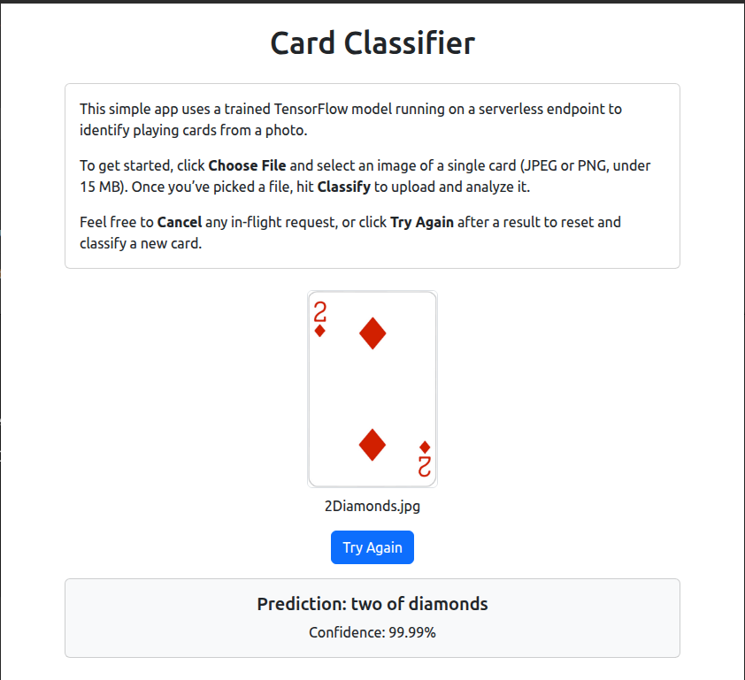
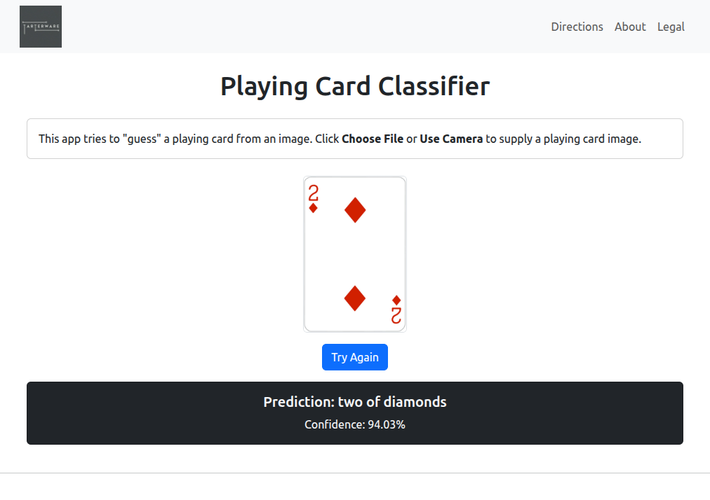
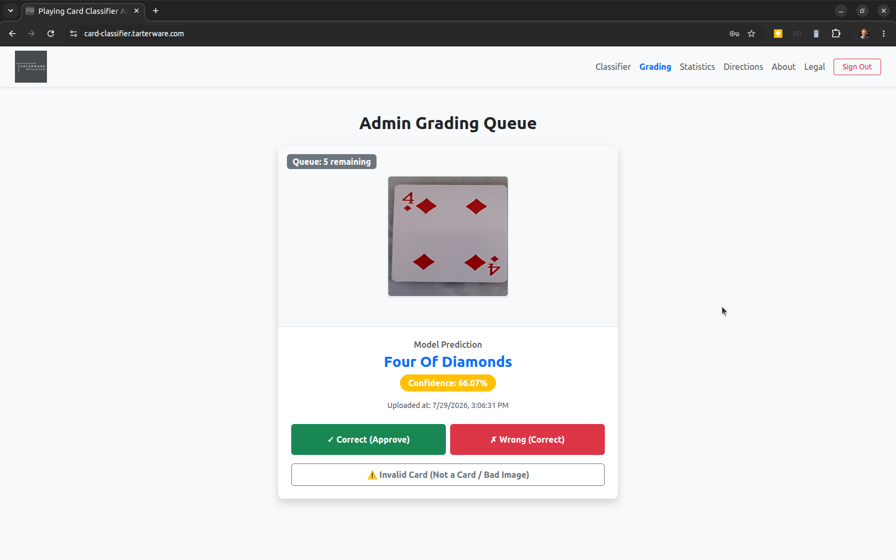
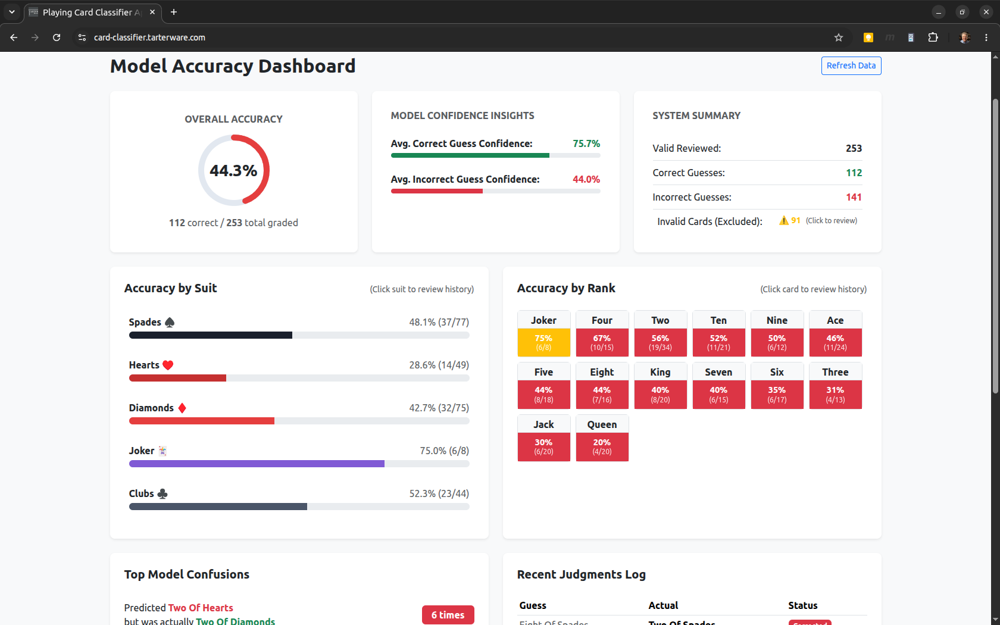
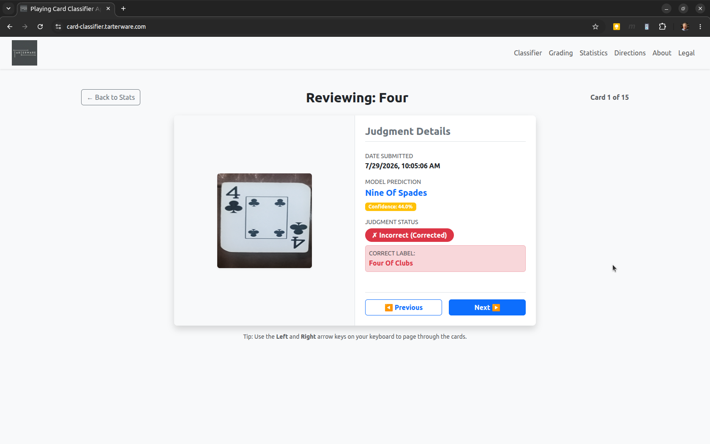

# Playing Card Classifier Frontend - Developer Guide

This directory contains the React-based frontend application for the Playing Card Classifier. The application allows users to upload an image of a single card (JPEG/PNG) or capture a photo using their device camera, and view the predicted card name and confidence score.

For deploying the production infrastructure (S3, CloudFront, Lambda, and SageMaker), please refer to the **[Root README](../README.md)**.

---

## Features

- **Image upload & preview**: Drag-and-drop or file picker with client-side validation (max 15 MB).
- **OffscreenCanvas resizing**: Scales images to 224 × 224 on the client side to match the ML model input size and minimize network payload.
- **Camera integration**: Captures high-res photos directly from the device's camera with digital zoom.
- **Abortable requests**: Cancel long-running classification requests via a timeout or "Cancel" button.
- **Try Again**: Instantly resets the UI for another classification.
- **Card Grading Queue**: Admin panel to review recent predictions against raw images in S3 and record corrections.
- **Statistics Dashboard**: Accuracy breakdown grouped by suit and rank, with drill-down detailed prediction audits.
- **Admin Authentication**: JWT-based login integration to protect grading and stats endpoints.
- **Responsive UI**: Built using React and `react-bootstrap` components.

---

## Prerequisites

- **Node.js** >= 14
- **npm** or **yarn**
- A running backend API endpoint (deployable via the root `terraform/` directory).

---

## Getting Started

### 1. Install Dependencies
From within the `frontend/` directory, run:
```bash
npm install
```

### 2. Configure API Endpoint
Create a `.env.development.local` file in this directory to specify your backend API URL for local development:
```env
REACT_APP_API_BASE_URL=https://<your-api-id>.execute-api.<region>.amazonaws.com/dev
```
*(This file is ignored by Git and overrides any default `.env` settings).*

### 3. Run in Development Mode
Start the local webpack dev server:
```bash
npm start
```
The application will open automatically at `http://localhost:3000`.

---

## Environment Variables

| Variable | Description |
| :--- | :--- |
| `REACT_APP_API_BASE_URL` | Base URL for the prediction endpoint (excluding the `/predictCardLabel` path). |

---

## Project Structure

```text
frontend/
├── public/                 # Static assets (HTML template, favicon, manifest)
├── Resources/              # Static assets for documentation
│   └── img/                # Screenshot examples of the interface
├── src/                    # React application source code
│   ├── App.js              # Application shell
│   ├── AuthHelper.js       # Admin authentication helper functions
│   ├── CardClassifier.jsx  # Main card classification component
│   ├── GradingDashboard.jsx# Admin grading queue component
│   ├── InfoPanel.jsx       # Informational sidebar component
│   ├── Login.jsx           # Admin login portal component
│   ├── NavBar.jsx          # Header navigation bar
│   ├── NavBarBrand.jsx     # Branding logo component
│   ├── ReviewDetails.jsx   # Stats drill-down card review component
│   ├── StatisticsDashboard.jsx # Accuracy visualization component
│   ├── index.js            # React entry point
│   ├── index.css           # Global CSS and Bootstrap imports
│   └── App.css             # Component styling overrides
├── package.json            # npm package definition & scripts
└── README.md               # This documentation file
```

---

## Interface Examples

### 1. Main Card Classifier (User Upload & Camera)


### 2. Admin Login


### 3. Card Grading Queue


### 4. Accuracy Statistics Dashboard


### 5. Detailed Review & Audit


---

## Troubleshooting

- **Spinner not animating**: Ensure Bootstrap CSS is imported in `src/index.js` *before* custom CSS:
  ```javascript
  import "bootstrap/dist/css/bootstrap.min.css";
  import "./index.css";
  ```
- **CORS errors**: Confirm your API Gateway / Lambda CORS origins list includes the URL you are accessing the frontend from (e.g. `http://localhost:3000` or your custom domain). Whitelisted origins are managed in `lambda/app.py`.
